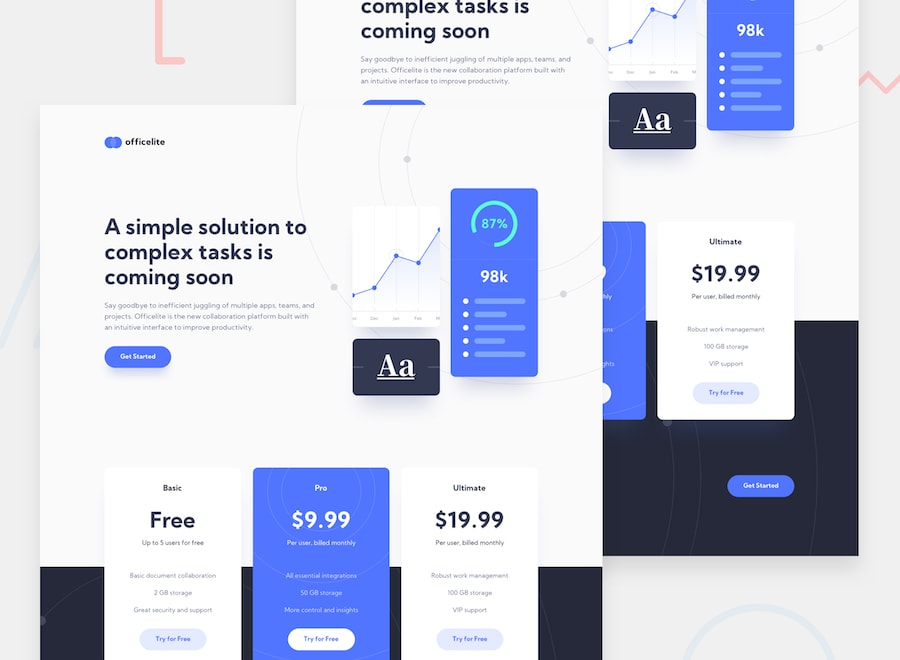

# Officelite coming soon site



## Table of contents

- [Overview](#overview)
  - [The job](#the-job)
  - [Links](#links)
- [My process](#my-process)
  - [Built with](#built-with)
  - [AI collaboration](#ai-collaboration)
  - [Figma-to-implementation workflow for AI](#figma-to-implementation-workflow-for-ai)
  - [Useful resources](#useful-resources)
- [Author](#author)

## Overview

### The job

Users should be able to:

- View the responsive Home and Sign Up compositions across compact, medium, and large layouts.
- Navigate from every Home call to action to Sign Up.
- Preserve Basic, Pro, or Ultimate when entering Sign Up from a plan action; generic and direct entry default to Basic.
- Use a native Plan select with standard pointer and keyboard behavior.
- Submit Name, Email Address, Plan, Phone Number, and Company as required fields for the current release.
- Receive field-specific feedback when required values are empty or the email address is syntactically invalid.
- Store a valid sign-up record in browser IndexedDB without sending it to a remote API.
- Receive visible and programmatically announced confirmation after a successful IndexedDB transaction.
- Receive visible and programmatically announced failure feedback when IndexedDB storage cannot complete, without losing entered values where technically possible.
- See a launch countdown that updates visually once per second.
- Use all current navigation, selection, validation, submission, and feedback behavior by keyboard with visible focus.

The marketing copy, pricing, plan features, and launch date are placeholders. A future API will provide the real launch date and process sign-up data, but those integrations are outside the current release.

### Links

- Repository: [https://github.com/ferfalcon/officelite-coming-soon-site](https://github.com/ferfalcon/officelite-coming-soon-site)
- Live site: [https://officelite-coming-soon-site-ferfalcon.vercel.app/](https://officelite-coming-soon-site-ferfalcon.vercel.app/)

## My process

### Built with

- Semantic HTML5 markup
- CSS custom properties
- Flexbox
- CSS Grid
- Mobile-first workflow
- [Astro](https://astro.build/) — web framework
- [TypeScript](https://www.typescriptlang.org/) — typed JavaScript

### AI collaboration

- ChatGPT
  - Inspect and analyze Figma files
  - Maintain the Figma-to-implementation documentation workflow
- Codex
  - Project code implementation

### Figma-to-implementation workflow for AI

[https://github.com/ferfalcon/figma-to-implementation-workflow](https://github.com/ferfalcon/figma-to-implementation-workflow)

### Useful resources

- [Google | Build with Modern Web Guidance](https://developer.chrome.com/docs/modern-web-guidance) — modern web-platform guidance for coding agents

```bash
pnpm dlx skills add GoogleChrome/modern-web-guidance
```

## Author

- Website — [ferfalcon.com](http://ferfalcon.com/)
- LinkedIn — [Fernando Falcon](https://www.linkedin.com/in/fernandofalcon/)
