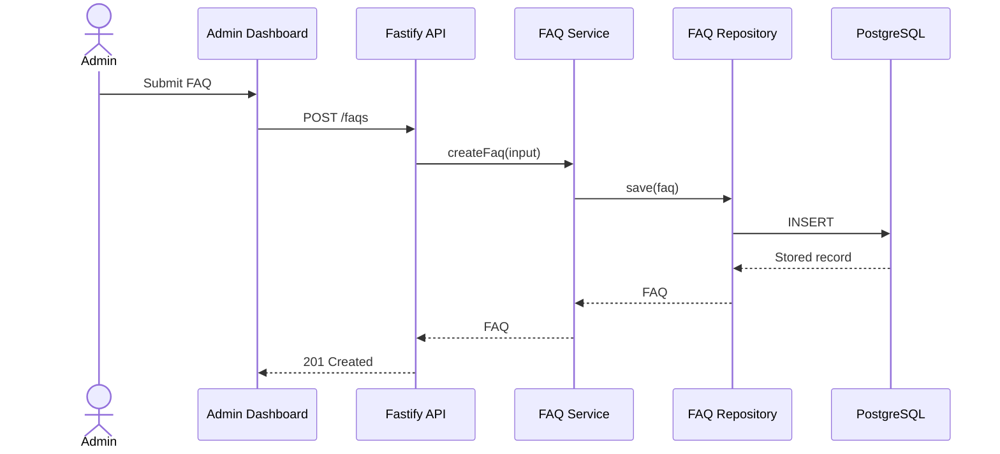

`ARCHITECTURE.md` is a project document that explains **how a software system is organized internally and why it is organized that way**.

It describes the system at a higher level than individual implementation files. A new developer should be able to read it and understand:

* the major parts of the system;
* how those parts communicate;
* where different responsibilities belong;
* how data moves through the application;
* which architectural rules should be preserved;
* why important technical decisions were made.

---

## The central question

An `ARCHITECTURE.md` file answers:

> **How is this system structured, and why?**

For example:

```text
Browser
   ↓
React application
   ↓
Fastify API
   ↓
Service layer
   ↓
Repository layer
   ↓
PostgreSQL
```

The document should explain not only that these layers exist, but also:

* what each layer owns;
* which dependencies are allowed;
* where validation happens;
* where business logic lives;
* how errors are handled;
* how authentication works;
* how the system may evolve.

---

## What it is not

An `ARCHITECTURE.md` file is usually not:

* a complete product specification;
* a list of every component;
* a step-by-step implementation plan;
* API reference documentation;
* a replacement for code comments;
* a record of every minor technical decision.

It should focus on the system’s **structural model and architectural constraints**.

---

# Typical `ARCHITECTURE.md` structure

There is no mandatory format, but the following structure works well.

```md
# Architecture

## 1. Purpose

## 2. System Context

## 3. Architectural Goals

## 4. High-Level Architecture

## 5. Major Components

## 6. Dependency Rules

## 7. Data Flow

## 8. Data Architecture

## 9. API Architecture

## 10. Frontend Architecture

## 11. Authentication and Authorization

## 12. Error Handling

## 13. Security

## 14. Deployment Architecture

## 15. Observability

## 16. Testing Strategy

## 17. Architectural Decisions

## 18. Constraints and Trade-offs

## 19. Known Risks

## 20. Future Evolution
```

Not every project needs every section. A small frontend component may need only five or six sections.

---

# Recommended section-by-section format

## 1. Purpose

Explain why the document exists and what part of the system it covers.

```md
## Purpose

This document describes the architecture of the FAQ platform,
including the public website, administration dashboard, API,
database, authentication model, and deployment environment.

It defines the major system boundaries, dependency rules, and
technical decisions that implementations must preserve.
```

This prevents confusion about whether the document covers the whole repository, one application, or one feature.

---

## 2. System context

Describe the system from the outside.

Identify:

* users;
* external systems;
* third-party services;
* major inputs and outputs.

```md
## System Context

The platform has two user groups:

1. Public visitors, who browse and search published FAQs.
2. Administrators, who manage FAQ content through a protected dashboard.

The system consists of:

- a public React application;
- an administration React application;
- a Fastify API;
- a PostgreSQL database;
- an external hosting and deployment platform.
```

A small context diagram is often useful:

```text
Public visitor ──→ Public web application ──→ API
                                             │
Administrator ──→ Admin dashboard ───────────┤
                                             ↓
                                         PostgreSQL
```

---

## 3. Architectural goals

State the qualities the architecture is designed to support.

Examples:

* maintainability;
* accessibility;
* testability;
* separation of concerns;
* scalability;
* security;
* replaceable infrastructure;
* clear ownership of business rules.

```md
## Architectural Goals

The architecture prioritizes:

- clear separation between HTTP, business, and persistence concerns;
- independent testing of business rules;
- predictable TypeScript types across application boundaries;
- accessible and responsive interfaces;
- simple local development and deployment;
- the ability to replace database infrastructure without rewriting
  application logic.
```

These goals provide criteria for evaluating architectural decisions later.

---

## 4. High-level architecture

Present the overall structure.

```md
## High-Level Architecture

The project uses a client-server architecture.

- React applications provide the user interfaces.
- Fastify exposes the HTTP API.
- Application services coordinate business operations.
- Repository interfaces isolate database access.
- Prisma implements persistence against PostgreSQL.
```

For a monorepo:

```text
apps/
├── api-server/
├── public-web/
└── admin-web/

packages/
├── domain/
├── validation/
└── shared-types/
```

The document should explain what those directories mean, rather than simply listing them.

---

## 5. Major components

Describe the important subsystems and their responsibilities.

```md
## Major Components

### Public Web Application

Responsible for:

- displaying published FAQs;
- filtering by category;
- searching FAQ content;
- supporting shareable question URLs;
- exposing accessible accordion interactions.

It cannot create, update, or delete FAQ records.

### Administration Dashboard

Responsible for:

- authenticating administrators;
- managing FAQs and categories;
- changing publication state;
- changing display order;
- displaying validation and API errors.

### API Server

Responsible for:

- validating HTTP requests;
- authenticating protected operations;
- authorizing administrative actions;
- coordinating application services;
- translating application errors into HTTP responses.

### Persistence Layer

Responsible for:

- reading and writing database records;
- implementing repository contracts;
- executing transactions;
- mapping persistence records to domain objects.
```

The key is to define **responsibility boundaries**.

---

## 6. Dependency rules

This is one of the most useful sections.

It should state what is allowed to depend on what.

````md
## Dependency Rules

Dependencies flow inward:

```text
HTTP routes
    ↓
Application services
    ↓
Domain rules
    ↓
Repository interfaces

Infrastructure implementations
    ↓
Repository interfaces
````

Rules:

1. Route handlers may depend on application services.
2. Application services may depend on domain models and repository interfaces.
3. Domain code must not depend on Fastify, Prisma, React, or PostgreSQL.
4. Prisma repository implementations may depend on Prisma.
5. React components must not access the database directly.
6. Business rules must not be implemented exclusively inside route handlers.

````

Without dependency rules, the document may describe the current system but fail to guide future changes.

---

## 7. Data flow

Show what happens during important operations.

Example: creating an FAQ.

```md
## Data Flow

### Create FAQ

1. The administrator submits the FAQ form.
2. The dashboard validates basic form constraints.
3. The dashboard sends `POST /faqs`.
4. Fastify validates the request schema.
5. The authentication layer identifies the administrator.
6. `CreateFaqService` applies business rules.
7. `FaqRepository` persists the FAQ.
8. The API returns the created resource.
9. The dashboard updates its local state.
````

A sequence diagram can also be written with Mermaid:



Only include diagrams that improve understanding. A large diagram containing every file generally becomes difficult to maintain.

---

## 8. Data architecture

Explain the important data model and relationships.

```md
## Data Architecture

The primary entities are:

- `Faq`
- `Category`
- `Administrator`
- `AuditEntry`

Relationships:

- one category can contain many FAQs;
- each FAQ belongs to one category;
- an administrator can create many audit entries;
- an audit entry records one administrative action.
```

You may include a simplified model:

```text
Category
- id
- name
- slug

Faq
- id
- question
- answer
- status
- order
- categoryId
- createdAt
- updatedAt
```

Avoid duplicating the entire database schema unless that schema is central to understanding the architecture.

---

## 9. API architecture

Explain the conventions governing the API.

```md
## API Architecture

The API uses resource-oriented HTTP endpoints.

Public endpoints:

- `GET /faqs`
- `GET /faqs/:slug`
- `GET /categories`

Administrative endpoints:

- `POST /faqs`
- `PATCH /faqs/:id`
- `DELETE /faqs/:id`
- `PATCH /faqs/reorder`

Conventions:

- JSON is used for requests and responses.
- Request and response schemas are explicitly defined.
- Validation errors return `400`.
- Authentication failures return `401`.
- Authorization failures return `403`.
- Missing resources return `404`.
- Unexpected failures return `500` without exposing internal details.
```

The detailed payload definitions may belong in `SPEC.md`, OpenAPI, or dedicated API documentation.

---

## 10. Frontend architecture

Explain how the frontend is structured.

````md
## Frontend Architecture

The frontend is organized by feature rather than by file type.

```text
src/
├── app/
├── features/
│   ├── authentication/
│   ├── faqs/
│   └── categories/
├── shared/
│   ├── components/
│   ├── hooks/
│   └── utilities/
└── styles/
````

Rules:

* feature-specific code stays inside its feature directory;
* shared components contain no product-specific business logic;
* server state is separated from transient interface state;
* API requests are centralized in typed client modules;
* accessibility behavior is part of component implementation,
  not an optional enhancement.

````

This is more useful than documenting every React component individually.

---

## 11. Authentication and authorization

Explain the security model.

```md
## Authentication and Authorization

Administrators authenticate using an email and password.

After successful authentication, the API issues a signed JWT.

The client sends the token with protected requests:

```http
Authorization: Bearer <token>
````

Authentication answers:

> Who is making the request?

Authorization answers:

> Is this user allowed to perform this operation?

Public read operations do not require authentication. FAQ mutation
operations require an authenticated administrator.

````

Also document where tokens are stored, expiration behavior, logout semantics, and relevant trade-offs.

---

## 12. Error handling

Define the error model and responsibility boundaries.

```md
## Error Handling

Errors are classified into:

- validation errors;
- authentication errors;
- authorization errors;
- not-found errors;
- conflict errors;
- infrastructure errors;
- unexpected application errors.

Application services throw typed application errors. The HTTP layer
maps those errors to status codes and public response bodies.

Infrastructure details, stack traces, SQL errors, and secrets must
not be returned to clients.
````

---

## 13. Security

Document the architectural controls rather than merely saying “the application must be secure.”

```md
## Security

The architecture includes:

- password hashing using Argon2;
- signed and expiring authentication tokens;
- server-side authorization checks;
- schema validation for all external input;
- environment variables for secrets;
- restricted CORS origins;
- parameterized database access through Prisma;
- rate limiting on authentication endpoints;
- safe error responses;
- audit records for administrative mutations.
```

---

## 14. Deployment architecture

Describe where each part runs and how it connects.

````md
## Deployment Architecture

```text
Browser
   ↓ HTTPS
Vercel: React application
   ↓ HTTPS
Render: Fastify API
   ↓ TLS
Neon: PostgreSQL
````

Environment-specific configuration is provided through environment variables.

The API is stateless. Persistent data is stored exclusively in PostgreSQL.
Database migrations run as part of the deployment process before the new
application version receives traffic.

````

---

## 15. Observability

Explain how the system can be understood when something goes wrong.

```md
## Observability

The API produces structured logs containing:

- request identifier;
- route;
- HTTP method;
- status code;
- execution duration;
- authenticated user identifier when available;
- sanitized error information.

Passwords, tokens, secrets, and sensitive request content must not be logged.
````

For a small project, logging and basic health checks may be enough.

---

## 16. Testing strategy

Describe testing layers and what belongs in each.

```md
## Testing Strategy

### Unit tests

Test domain rules and application services without HTTP or database access.

### Integration tests

Test repository implementations, database behavior, authentication,
and API routes.

### Component tests

Test React component behavior, validation, keyboard interaction,
and accessibility states.

### End-to-end tests

Test critical flows such as:

- administrator login;
- FAQ creation and publication;
- public FAQ discovery;
- FAQ reordering;
- logout and protected-route enforcement.
```

---

## 17. Architectural decisions

Record significant decisions and their rationale.

```md
## Architectural Decisions

### Use a repository abstraction

**Decision:** Application services depend on repository interfaces rather
than Prisma directly.

**Reason:** This separates business logic from persistence and allows
services to be tested using in-memory repositories.

**Trade-off:** It introduces additional interfaces and mapping code.

### Use a modular monolith

**Decision:** The API is deployed as one application rather than as
multiple services.

**Reason:** The current scale does not justify distributed-system
complexity.

**Trade-off:** Modules cannot be deployed independently.
```

For larger projects, these decisions may instead be stored as individual Architecture Decision Records:

```text
docs/
└── architecture/
    ├── ARCHITECTURE.md
    └── decisions/
        ├── 0001-use-postgresql.md
        ├── 0002-use-jwt-authentication.md
        └── 0003-use-modular-monolith.md
```

---

## 18. Constraints and trade-offs

A good architecture document should admit limitations.

```md
## Constraints and Trade-offs

- The project uses a modular monolith to reduce operational complexity.
- The API cannot scale individual modules independently.
- JWT logout does not automatically invalidate an already-issued token
  unless token revocation is added.
- Client-side rendering simplifies deployment but provides weaker initial
  search-engine rendering than server-side rendering.
- Prisma increases development speed but creates some coupling inside the
  infrastructure layer.
```

Architecture always involves trade-offs. A document that describes only advantages is usually incomplete.

---

## 19. Known risks

Document architectural risks that need attention.

```md
## Known Risks

1. FAQ ordering may produce conflicting values during concurrent updates.
2. Search performance may degrade as the FAQ collection grows.
3. Audit logs may grow indefinitely without a retention policy.
4. Shared frontend types may accidentally become coupled to API transport models.
5. Token storage strategy must be reviewed before handling sensitive production data.
```

---

## 20. Future evolution

Describe likely growth paths without treating them as current requirements.

```md
## Future Evolution

The architecture should allow future support for:

- multiple administrator roles;
- FAQ version history;
- full-text database search;
- content localization;
- external identity providers;
- independent public and administrative deployments.

These capabilities are not part of the current implementation unless
explicitly included in the specification.
```

That last sentence prevents future ideas from becoming accidental requirements.

---

# Compact template

````md
# Architecture

## 1. Purpose

Describe the scope and purpose of this document.

## 2. System Context

Identify users, external systems, and major application boundaries.

## 3. Architectural Goals

- Maintainability
- Testability
- Security
- Accessibility
- Simplicity

## 4. High-Level Architecture

Describe the principal applications, services, and infrastructure.

```text
Client → API → Application Services → Repository → Database
````

## 5. Components and Responsibilities

### Component A

Responsibilities:

* ...
* ...

Must not:

* ...
* ...

### Component B

Responsibilities:

* ...
* ...

## 6. Dependency Rules

1. ...
2. ...
3. ...

## 7. Important Data Flows

### Flow A

1. ...
2. ...
3. ...

## 8. Data Architecture

Describe the main entities, relationships, ownership, and persistence rules.

## 9. API Architecture

Describe endpoint organization, validation, versioning, and error conventions.

## 10. Frontend Architecture

Describe features, state ownership, component boundaries, routing, and API access.

## 11. Authentication and Authorization

Describe identity, permissions, token or session management, and protected boundaries.

## 12. Error Handling

Describe error categories, propagation, logging, and client responses.

## 13. Security

Describe trust boundaries and security controls.

## 14. Deployment

Describe environments, hosting, networking, migrations, and configuration.

## 15. Observability

Describe logs, metrics, tracing, health checks, and alerting.

## 16. Testing Strategy

Describe unit, integration, component, and end-to-end test boundaries.

## 17. Architectural Decisions

### Decision

**Choice:**
...

**Reason:**
...

**Trade-offs:**
...

## 18. Constraints and Risks

* ...
* ...

## 19. Future Evolution

* ...
* ...

````

---

# Example for a small frontend component

An `ARCHITECTURE.md` does not have to describe an entire backend system. It can document a reusable UI component.

```md
# FAQ Accordion Architecture

## Purpose

This document describes the internal structure and behavioral boundaries
of the FAQ accordion component.

## Component Structure

```text
FaqAccordion
└── FaqItem
    ├── FaqTrigger
    └── FaqPanel
````

## State Ownership

`FaqAccordion` owns the identifier of the currently expanded item.

`FaqItem` receives:

* whether it is expanded;
* a callback for toggling it;
* its trigger and panel identifiers.

Individual items do not maintain duplicate expansion state.

## Accessibility Architecture

Each trigger is a native `button`.

The trigger exposes:

* `aria-expanded`;
* `aria-controls`.

Each panel:

* has a stable `id`;
* references its trigger through `aria-labelledby`;
* is removed from keyboard navigation while collapsed.

## Dependency Rules

* Presentation styles must not determine component state.
* Content data must be passed into the component.
* The accordion must not fetch data directly.
* Keyboard behavior must remain independent of animation behavior.

## Responsive Behavior

The component uses the available container width and does not rely on
viewport-specific JavaScript.

## Testing Boundaries

Tests cover:

* mouse activation;
* keyboard activation;
* focus visibility;
* expanded and collapsed ARIA states;
* one-item and multiple-item modes;
* reduced-motion behavior.

````

For a single component, this may be enough.

---

# How detailed should it be?

The correct detail level is:

> Detailed enough to guide implementation and protect architectural boundaries, but not so detailed that every code change makes it obsolete.

Good content:

```md
Business logic belongs in application services.
````

Too vague:

```md
The application follows best practices.
```

Too implementation-specific:

```md
Line 42 of `faq.service.ts` calls `repository.findBySlug()`.
```

The architecture document should remain valid even when individual function names or files change.

---

# A useful quality test

After reading `ARCHITECTURE.md`, a developer should be able to answer:

1. What are the major parts of the system?
2. What responsibility belongs to each part?
3. How does data move through the system?
4. Where does business logic live?
5. Which dependencies are allowed?
6. How are authentication and authorization handled?
7. How is persistent data organized?
8. How is the system deployed?
9. What architectural trade-offs were accepted?
10. Which decisions must not be changed casually?

When those answers remain unclear, the document needs more precision.

---

For very small components, `ARCHITECTURE.md` can be a section inside `SPEC.md`. For complete applications, monorepos, or features involving frontend, backend, persistence, authentication, and deployment, keeping it as a separate document is usually valuable.
